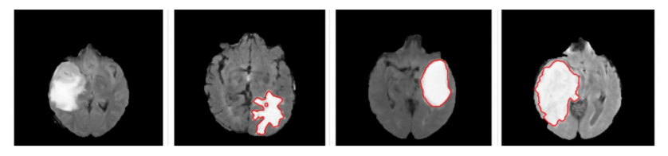
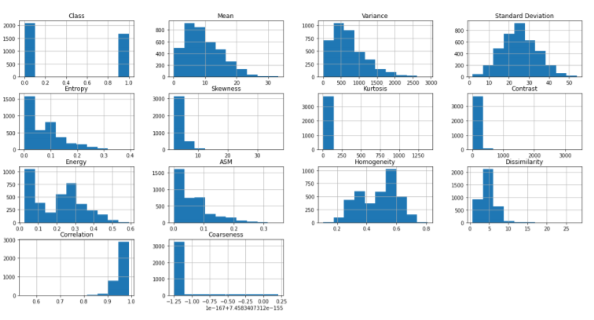

# Brain-Tumor-Classification

## Project Overview
Brain tumors account for 85% to 90% of all primary central nervous system
(CNS) tumors. All types of brain tumors may produce symptoms that vary
depending on the part of the brain involved. These symptoms may include
headaches, seizures, problems with vision, vomiting and mental changes.Detection of Brain Tumor manually is a recurring activity which consumes a
lot of time and also the results are not accurate. MRI helps in analysis of Brain
Tumor along with CT images as well as ultrasonic or X-Rays. The advanced
technology of brain MRI image data has created more opportunities for
neurosurgeons and medical scientists to diagnose brain tumors. The detection
of tumor size at an early stage must be detected accurately for the diagnosis
purpose and which will increase the survival rate of the tumor.  
Reference : https://medium.com/analytics-vidhya/brain-tumor-classification-using-different-machine-learning-algorithms-423421175028

## Dataset 

This is a brain tumor feature dataset including five first-order features and
eight texture features with the target level (in the column Class). Within the
research papers we referred, they first used deep learning techniques to extract
the features related to the brain tumor from the given images, but due to our
constraints we directly took the extracted features and applied machine
learning algorithms to predict whether the person has a tumor based on the
values of the features.
We choose this dataset for a number of reasons, firstly because the research
papers we referred used some similar features compared to this data. Also
seeing that all the features have numerical values we decided it would prove to
be a suitable dataset for the given requirements of the project.

### Independent Features:
1. Mean: Gives the contribution of individual pixel intensity for the entire image  
2. Variance: Used to find how each pixel varies from the neighbouring pixel 
3. Standard Deviation: measures the deviation of measured Values or the data 
   from its mean.
4. Skewness: measures of symmetry, or more precisely, the lack of symmetry. 
5. Kurtosis: describes the peakiness e.g., a frequency distribution 
6. Contrast: the difference in luminance or colour across the image. 
7. Energy: It's the rate of change in the color/brightness/magnitude of the pixels
   over local areas. 
8. ASM (Angular second moment): is a measure of textural uniformity of an
   image. 
9. Entropy: is a statistical measure of randomness that can be used to characterize
   the texture of the image. 
10. Homogeneity: homogeneity expresses how similar certain elements (pixels) of
    the image are. 
11. Dissimilarity: is a numerical measure of how different two data objects are. 
12. Correlation: Correlation is the process of moving a filter mask often referred to
    as kernel over the image and computing the sum of products at each location
    (CNN alike) 
13. Coarseness: Describes the roughness/harshness of a texture 
### Dependent Feature:
Class: column defines either the image has tumor or not (1 = Tumor, 0 = NonTumor)

## EDA and Data Transformation

Following steps were taken to make our data ready for our model :
1. Detect Missing values
2. Find if data is balanced or not.
3. Distribution of each feature.
4. Correlation Matrix
5. Outlier detection and removal
6. Dimensionality Reduction
7. Feature Normalization

## Machine Learning Algorithms applied : 
1. Naive Bayes Classifier
2. K Nearest Neighbours
3. Logistic Regression
4. Support Vector Classifier/Machines
5. Artificial Neural Network
6. Decision Trees
7. Tree Ensembles : Bagging , Random Forest and Boosting

## Performance Metrics :
1. Confusion Matrix / Specificity / Sensitivity
 
2. ROC Curve
3. OOB Score and Log Loss

## Result Analysis
After seeing the accuracy and cv score of each algorithm and performing hyperparameter tuning on each one using GridSearchCV , the below results were seen : 

